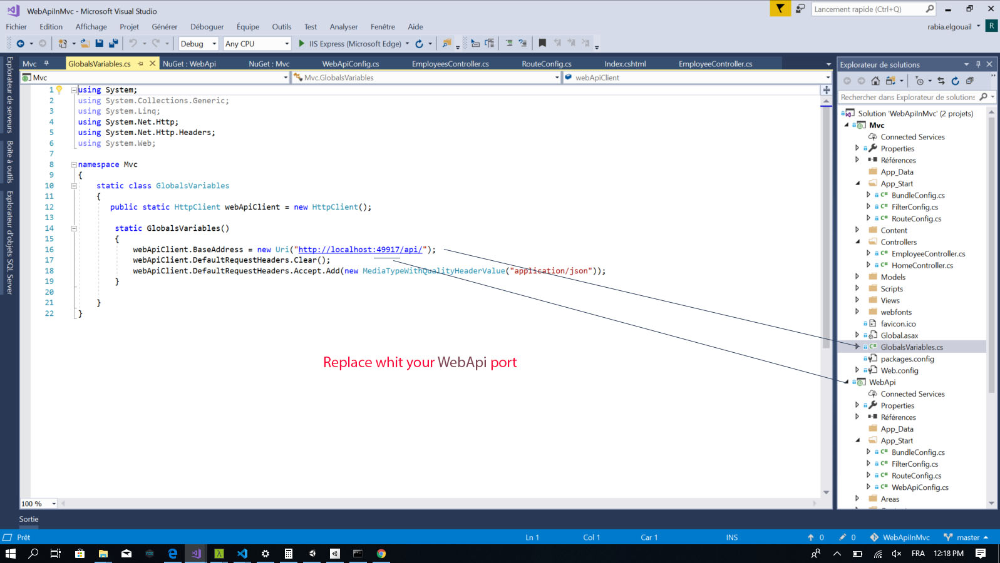
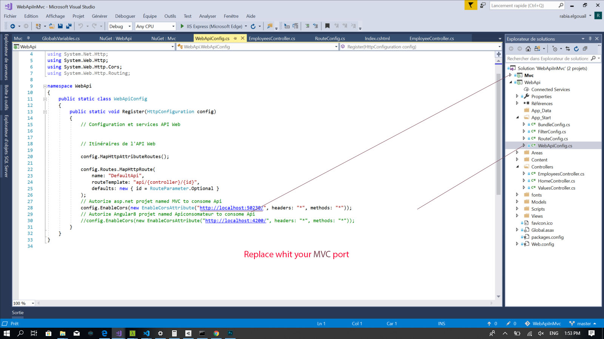

# WebApiInMvc-Gestion-Employees
rest ai created by asp.net webapi and consumed by Asp.net mvc Project
#package installed Project MVC:
-Popper
-AlertifyJS
#package installed Project WebApi:
-Microsoft.AspNet.WebApi.Cors
-EntityFramework

#Configuration Project MVC:

#Configuration Project WebApi:

you can also use Angular8 to consume API  :
https://github.com/iRELGE/ApiConsomateur.git

script SQL:
CREATE TABLE [dbo].[Employee] (
    [EmployeeId] INT          IDENTITY (1, 1) NOT NULL,
    [Name]       VARCHAR (50) NULL,
    [Position]   VARCHAR (50) NULL,
    [Age]        INT          NULL,
    [Salary]     INT          NULL,
    CONSTRAINT [Pk_Employee] PRIMARY KEY CLUSTERED ([EmployeeId] ASC)
);

////////////////////:
CREATE TABLE [dbo].[Users] (
    [Id]           INT          IDENTITY (1, 1) NOT NULL,
    [Name]         VARCHAR (50) NULL,
    [PasswordHash] VARCHAR (50) NULL,
    [Role]         VARCHAR (50) NULL,
    PRIMARY KEY CLUSTERED ([Id] ASC)
);
